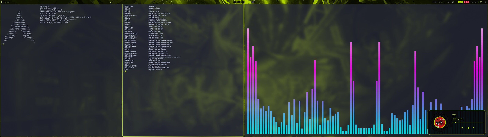
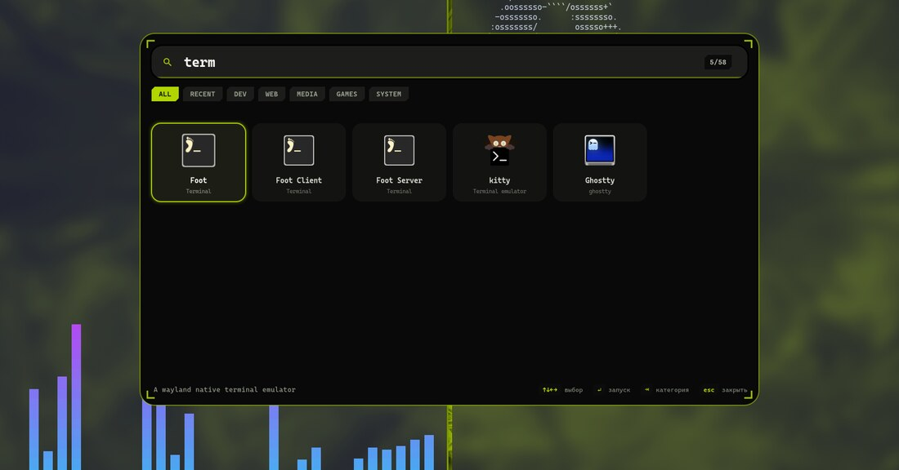
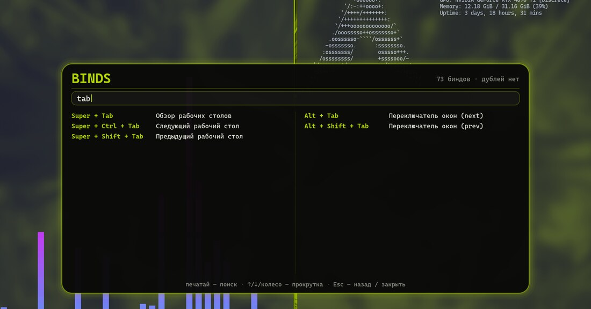
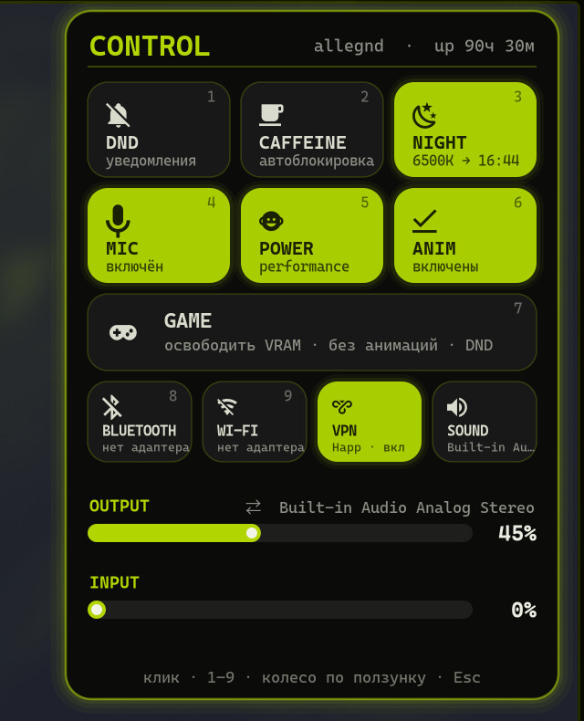
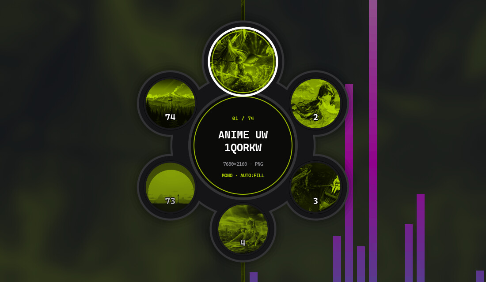
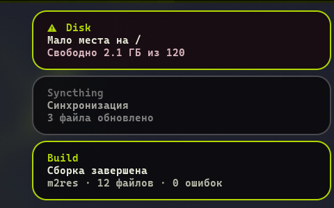
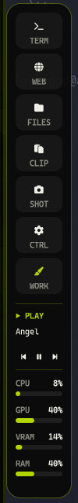

# m2res

Свой райс для Hyprland: панель Waybar, док, замок с HUD, центр уведомлений, плеер, лаунчер, профили, запись экрана, скриншоты, OCR, диктовка.
Рассчитан на Arch Linux, Hyprland 0.56+ (Lua-конфиг) и широкий монитор 32:9.



<p align="center"><i>Панель Waybar, плеер с визуализацией, терминалы. Скриншот с реального монитора 5120×1440@120.</i></p>

## Демо

| Лаунчер `SUPER+D` | Шпаргалка по биндам `SUPER+F1` |
|:--:|:--:|
|  |  |

| Центр управления `SUPER+X` | Выбор обоев `SUPER+W` |
|:--:|:--:|
|  |  |

| Уведомления | Док `SUPER+SHIFT+B` |
|:--:|:--:|
|  |  |

## Установка

```bash
git clone https://github.com/orybakov/m2res-rice.git
cd m2res-rice
bash install.sh
```

Скрипт сам: ставит недостающие пакеты через pacman и AUR (при необходимости сначала соберёт `yay`; один раз спросит пароль sudo), сохранит прежний `~/.config/m2res` в `~/Backups/m2res/pre-install-*.tar.gz`, скопирует райс, подключит автозапуск и бинды и запустит `m2res-doctor`. Если у вас нет `~/.config/hypr/hyprland.lua`, создаст его с базовыми биндами.

Ключи: `--check` (ничего не менять), `--no-user` (без Whisper ~0,5 ГБ), `--no-enable` (не трогать Hyprland), `--yes` (без вопросов). Откат: `~/.config/m2res/scripts/m2res-enable off`.

Подробнее: [.config/m2res/README.md](.config/m2res/README.md). После установки: `SUPER+F1` шпаргалка по биндам, `SUPER+CTRL+P` профили, `SUPER+SHIFT+B` док.
